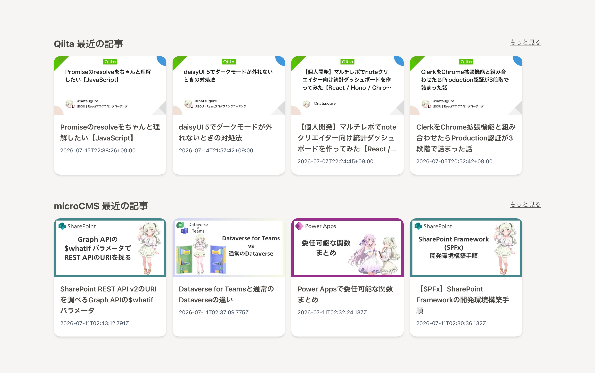
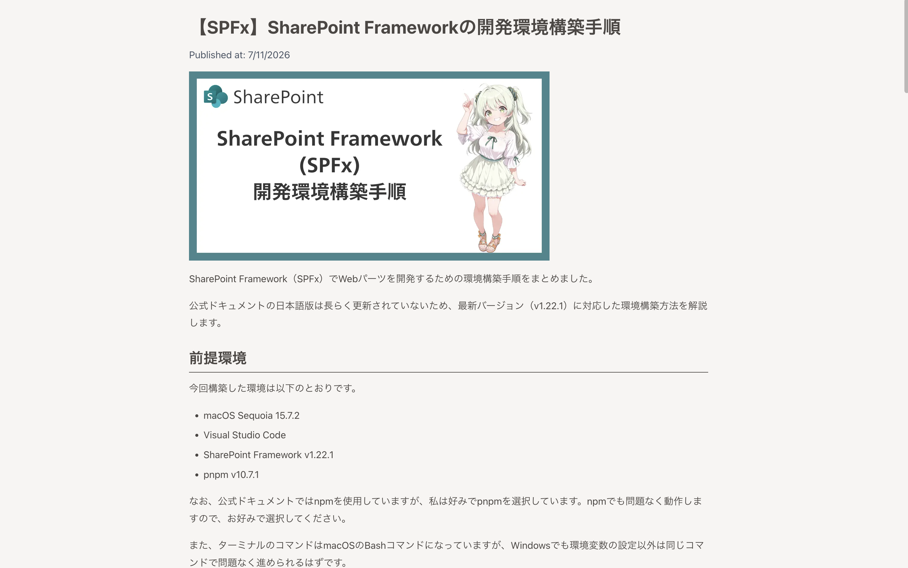
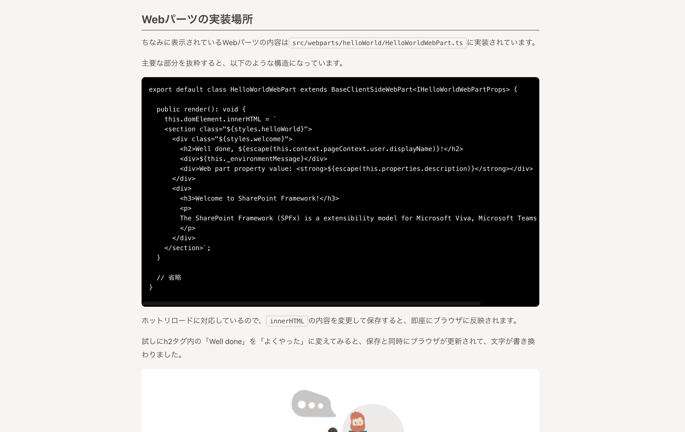

# なつぐれの技術ブログ

Next.js 16 (App Router) で構築した技術ブログです。Qiitaに投稿した記事とmicroCMSで管理しているオリジナル記事を一覧・表示します。

## 主な機能

- Qiita APIから自分の投稿記事を取得して一覧表示
- microCMSで管理しているブログ記事の一覧・詳細表示
- トップページでQiita記事・microCMS記事それぞれの最新4件を表示
- open-graph-scraperでQiitaのOGPアイキャッチ画像を取得

## 技術スタック

- [Next.js 16](https://nextjs.org/) (App Router, React Compiler)
- [React 19](https://react.react.dev/)
- [Tailwind CSS](https://tailwindcss.com/) / [daisyUI](https://daisyui.com/)
- [Firebase App Hosting](https://firebase.google.com/docs/app-hosting)
- [Vitest](https://vitest.dev/) / Testing Library
- [Qiita API](https://qiita.com/api/v2/docs)
- [microCMS](https://microcms.io/)

## 表示例







## セットアップ

パッケージマネージャーには pnpm を使用しています。

```bash
pnpm install
```

`.env.example` を参考に `.env` を作成し、必要な環境変数を設定してください。

```bash
cp .env.example .env
```

| 変数名 | 説明 |
| --- | --- |
| `QIITA_API_TOKEN` | Qiita APIの認証トークン |
| `MICROCMS_API_KEY` | microCMSのAPIキー |

## 開発サーバーの起動

```bash
pnpm dev
```

[http://localhost:3000](http://localhost:3000) をブラウザで開くと確認できます。

## テスト

```bash
pnpm test       # watchモードで実行
pnpm test:run   # 1回だけ実行
```

## ビルド・本番起動

```bash
pnpm build
pnpm start
```

`start` はポート3001で起動します（VSCodeの拡張機能とのポート競合を避けるため）。

## デプロイ

[Firebase App Hosting](https://firebase.google.com/docs/app-hosting) を使用してデプロイしています。設定内容は `firebase.json` と `apphosting.yaml` を参照してください。
